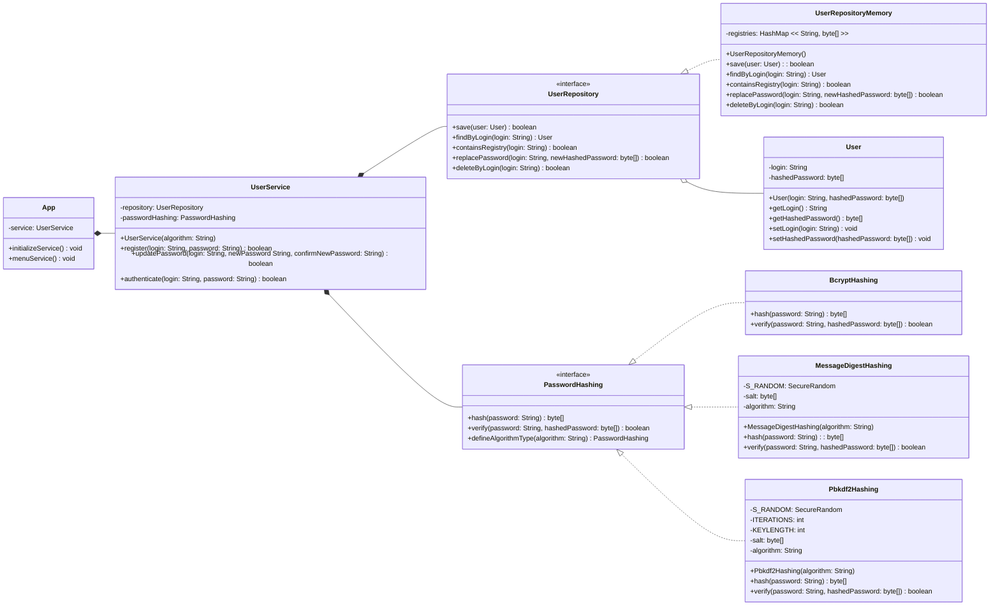

# Sistema de autenticação de usuários 🔓🔑
> Data: 27/11/2024  
> Autora: Luiza Kuze

## 💻 Tecnologias 
- Gradle
- Java 21
- Spring Security

## ✨ Funcionalidades
- **Armazenamento seguro de senhas**: as senhas são armazenadas como hashes para maior segurança.  
- **Persistência genérica**: utiliza uma tabela hash, mas pode ser adaptada para banco de dados relacional.  
- **Algoritmo de hash configurável**: o padrão é `BCrypt`, mas pode ser ajustado durante a inicialização do serviço. Os algoritmos implementados incluem:
    - `BCrypt`: Forte, com salting automático.  
    - `PBKDF2`: Algoritmo derivado de chave com suporte a múltiplas iterações, incluindo:  
    - `HmacSHA1`  
    - `HmacSHA256`  
    - `HmacSHA512`  
    - **MessageDigest**: Algoritmos de digest, incluindo:  
        - `MD5` (não recomendado para segurança moderna)  
        - `SHA-1` (mais seguro que MD5, mas desatualizado)  
        - `SHA-256` (recomendado)  
        - `SHA-512` (fortemente recomendado)  
- **Sistema de autenticação**: oferece as seguintes ações:  
  - Cadastro de usuários;  
  - Atualização de senhas;  
  - Autenticação de usuários.  

- **Interface via linha de comando**.
## 📚 Diagrama UML

## 📜 Licença

Este projeto é licenciado sob a MIT License.
